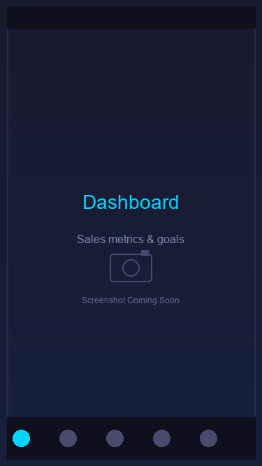
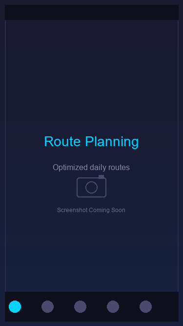
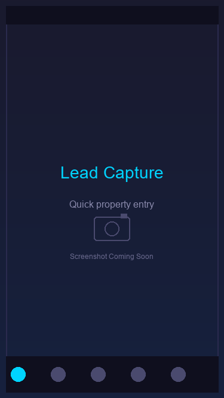
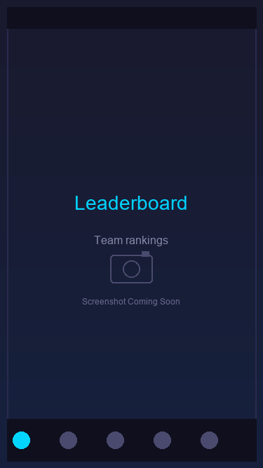
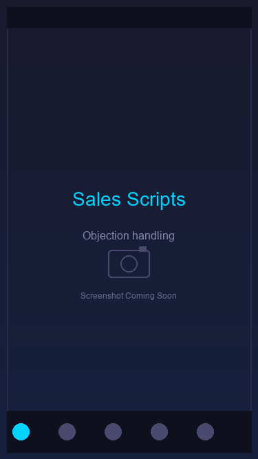

# HailTracker Pro

A comprehensive CRM and sales intelligence platform for Paintless Dent Repair (PDR) businesses, featuring real-time hail storm tracking, lead management, and a mobile Progressive Web App for field sales teams.

## Screenshots

### Mobile App - Dashboard
<!-- TODO: Add screenshot -->

*Real-time sales metrics, daily goals, and performance tracking*

### Mobile App - Route Planning
<!-- TODO: Add screenshot -->

*Optimized daily routes with map integration*

### Mobile App - Lead Capture
<!-- TODO: Add screenshot -->

*Quick lead entry with property details*

### Mobile App - Leaderboard
<!-- TODO: Add screenshot -->

*Gamified team competition and achievements*

### Mobile App - Sales Scripts
<!-- TODO: Add screenshot -->

*Objection handling and closing techniques*

### Mobile App - Competitor Intel
<!-- TODO: Add screenshot -->

*Track competitor activity in your territory*

---

## Features

### Core Platform
- **Hail Storm Tracking** - Real-time weather radar integration with storm path prediction
- **Lead Management** - Capture, qualify, and track leads through the sales pipeline
- **Territory Management** - Geographic territory assignment and optimization
- **Competitor Intelligence** - Track competitor activity and pricing in your market
- **Sales Analytics** - Comprehensive dashboards and performance metrics

### Customer Portal & Notifications
A full-featured customer portal with real-time job status notifications:

- **Real-Time Notifications** - SSE-powered instant updates when job status changes
- **Push Notifications** - Browser push notifications via Web Push API
- **Email Notifications** - Automated emails for key status updates
- **In-App Notifications** - Bell icon with notification dropdown
- **Notification Preferences** - Customers control which updates they receive
- **Quiet Hours** - Configurable do-not-disturb periods

### Elite Sales Mobile App (PWA)
A mobile-first Progressive Web App designed for field sales representatives:

- **Dashboard** - Real-time stats, daily goals, and performance metrics
- **Smart Route Planning** - Optimized daily routes with turn-by-turn navigation
- **Quick Lead Capture** - Fast lead entry with photo capture and voice notes
- **Instant Estimates** - On-the-spot damage assessment and pricing
- **Sales Scripts** - Objection handling and proven closing techniques
- **Leaderboard** - Gamified competition with achievements and rankings
- **Competitor Tracking** - Log competitor sightings and pricing intel
- **Offline Support** - Full functionality without internet connection

## Tech Stack

- **Backend**: Python, Flask
- **Database**: SQLite
- **Frontend**: HTML5, CSS3, JavaScript
- **Weather Data**: Py-ART (Python ARM Radar Toolkit)
- **Mobile**: Progressive Web App (PWA) with Service Workers
- **Authentication**: Flask-Login with bcrypt password hashing

## Installation

### Prerequisites
- Python 3.8+
- pip

### Setup

1. Clone the repository:
```bash
git clone https://github.com/downsydog/hailtracker-pro.git
cd hailtracker-pro
```

2. Create and activate a virtual environment:
```bash
python -m venv venv
source venv/bin/activate  # On Windows: venv\Scripts\activate
```

3. Install dependencies:
```bash
pip install -r requirements.txt
```

4. Initialize the database and seed demo data:
```bash
python scripts/seed_elite_sales_demo.py
```

5. Generate PWA icons (optional):
```bash
python scripts/generate_pwa_icons.py
```

6. Run the application:
```bash
python run.py
```

The application will be available at `http://127.0.0.1:5000`

### Push Notification Setup (Optional)

Browser push notifications require VAPID keys for authentication:

1. **Install pywebpush** (already in requirements.txt):
```bash
pip install pywebpush
```

2. **Generate VAPID keys** (auto-generated on first run, or set manually):
```bash
# Option 1: Auto-generated - keys stored in database on first WebPushManager init

# Option 2: Set environment variables
export VAPID_PRIVATE_KEY="your-base64-private-key"
export VAPID_PUBLIC_KEY="your-base64-public-key"
export VAPID_CLAIM_EMAIL="mailto:admin@yourcompany.com"
```

3. **Enable in Customer Portal**:
   - Login to customer portal at `/portal/`
   - Click "Enable" on the push notification banner
   - Allow browser notification permission
   - Test from Notification Preferences page

## Usage

### Demo Login
- **Username**: `demo`
- **Password**: `demo123`

### Accessing the Mobile App
1. Login at `/auth/login`
2. Navigate to `/mobile/app` or click "Elite Sales" in the navigation
3. On mobile devices, use "Add to Home Screen" for the full PWA experience

### Mobile App Views
| Route | Description |
|-------|-------------|
| `/mobile/app` | Main mobile application |
| `/mobile/dashboard` | Sales dashboard with daily metrics |
| `/mobile/leads` | Lead management and capture |
| `/mobile/route` | Daily route planning and navigation |
| `/mobile/estimate` | Quick damage estimation tool |
| `/mobile/scripts` | Sales scripts and objection handlers |
| `/mobile/leaderboard` | Team rankings and achievements |
| `/mobile/competitors` | Competitor intelligence logging |

## API Endpoints

### Customer Portal API
| Endpoint | Method | Description |
|----------|--------|-------------|
| `/portal/api/notifications` | GET | Get customer notifications |
| `/portal/api/notifications/<id>/read` | POST | Mark notification as read |
| `/portal/api/notifications/mark-all-read` | POST | Mark all notifications read |
| `/portal/api/notifications/stream` | GET | SSE stream for real-time updates |
| `/portal/api/push/vapid-public-key` | GET | Get VAPID public key |
| `/portal/api/push/subscribe` | POST | Subscribe to push notifications |
| `/portal/api/push/unsubscribe` | POST | Unsubscribe from push |
| `/portal/api/push/test` | POST | Send test push notification |

### Elite Sales API
| Endpoint | Method | Description |
|----------|--------|-------------|
| `/api/elite/mobile/dashboard` | GET | Dashboard stats for salesperson |
| `/api/elite/mobile/checkin` | POST | Location check-in |
| `/api/elite/mobile/quick-lead` | POST | Quick lead capture |
| `/api/elite/leaderboard` | GET | Team leaderboard |
| `/api/elite/achievements/{id}` | GET | Salesperson achievements |
| `/api/elite/competitors` | GET/POST | Competitor sightings |
| `/api/elite/scripts` | GET | Sales scripts library |
| `/api/elite/dnk` | GET/POST | Do Not Knock list |

## Project Structure

```
hailtracker-pro/
├── src/
│   ├── crm/                    # CRM core modules
│   │   └── elite_sales.py      # Elite Sales manager
│   └── web/
│       ├── app.py              # Flask application
│       ├── routes/
│       │   ├── elite_sales.py  # Elite Sales API routes
│       │   └── mobile.py       # Mobile PWA routes
│       └── templates/
│           └── mobile/         # Mobile app templates
├── static/
│   └── mobile/
│       ├── css/                # Mobile stylesheets
│       ├── js/                 # Mobile JavaScript app
│       └── icons/              # PWA icons
├── scripts/
│   ├── seed_elite_sales_demo.py
│   └── generate_pwa_icons.py
├── data/                       # SQLite databases
└── run.py                      # Application entry point
```

## License

MIT License

## Contributing

1. Fork the repository
2. Create a feature branch (`git checkout -b feature/amazing-feature`)
3. Commit your changes (`git commit -m 'Add amazing feature'`)
4. Push to the branch (`git push origin feature/amazing-feature`)
5. Open a Pull Request
